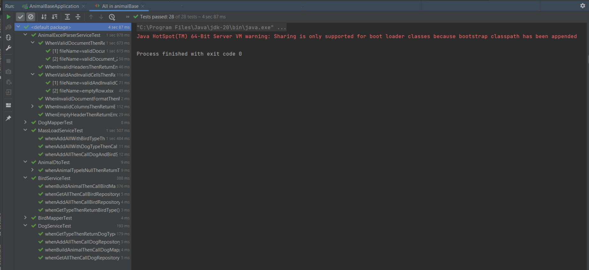
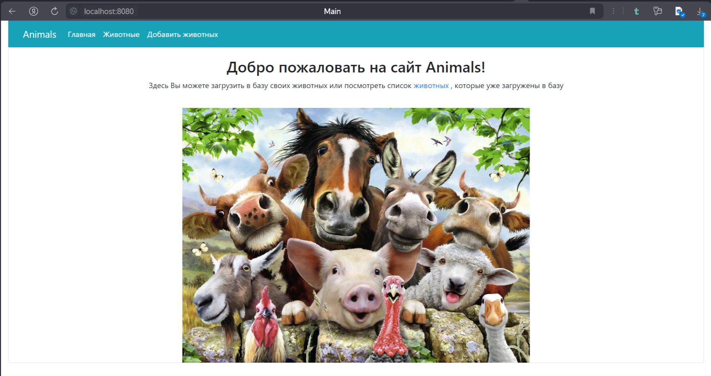
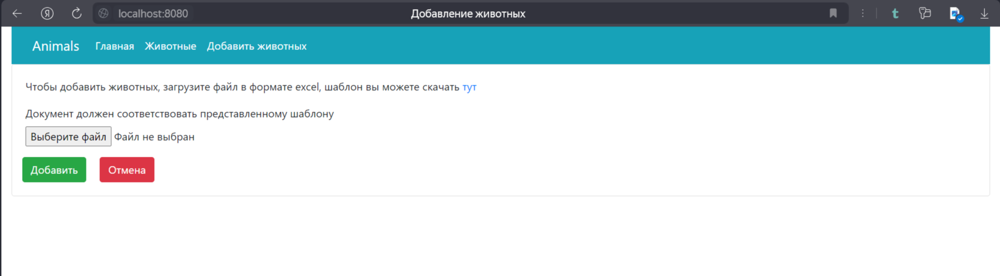
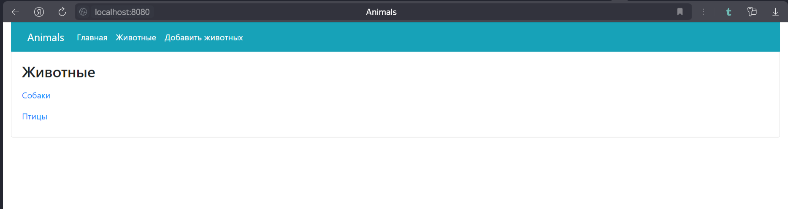
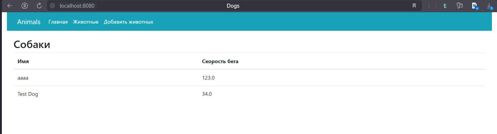
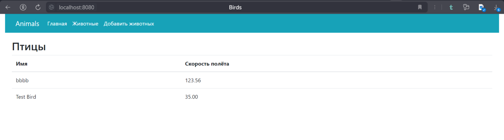

## Тестовое задание для компании Inter ID

Задача: реализовать Spring Boot приложение, принимающее в контроллер файл формата excel. В файле имеются три колонки:"
Тип","Имя", "Параметр". Данный файл требуется распарсить на объекты двух видов: Dog и Bird (в зависимости от значения
колонки "Тип"). Полученные объекты нужно сохранить в базу данных.

### Дополнительные требования к файлу excel:

+ Колонка "Тип" - это строка, принимающая два возможных значения ("Собака" и "Птица"), в зависимости от которых
  создаются объекты.
+ Колонка "Имя" - строка.
+ Колонка "Параметр" может быть как строкой, так и числом (строка для типа "Собака" и число для типа "Птица").
+ В документе должна быть одна страница

### Требования к инструментам:

Spring Boot. Иные требования к библиотекам и технологиям для реализации бизнес-логики не указаны.

### Используемые инструменты:

+ IntelliJ Idea
+ JDK 20
+ Maven
+ PostgreSQL

### Используемый стек технологий:

+ Spring Boot
+ Spring Data
+ Lombok
+ Apache POI
+ Mapstruct
+ Jpa
+ JUnit 5
+ Mockito
+ Liquibase
+ Thymeleaf

В PostgreSQL создана база данных "animals" (при отсутствии необходимо создать), создание таблиц осуществляется с помощью
liquibase.

Сервисы, мапперы, дто покрыты тестами:

Главная страница:

На главной странице представлена общая информация о текущем сайте и дана ссылка на страницу с загруженными в базу
животными.

Вкладка "Добавить животных" переносит пользователя на страницу добавления животных, на которой имеется форма для
загрузки файла:

Требования к загружаемому файлу представлены [выше](#Дополнительные-требования-к-файлу-excel). Кроме того, на данной
странице можно скачать шаблон excel документа, который удовлетворяет указанным требованиям. Его можно использовать для
заполнения данных.

Если добавленный файл удовлетворяет всем требованиям, то после нажатия на кнопку "Добавить" появится страница, на
которой отображена информация о номерах успешно обработанных строк:

Если добавленный файл имеет формат, отличных от excel, то после нажатия на кнопку "Добавить" появится страница,
оповещающая о данной ошибке:

Также при некорректном формате данных возможны следующие возникновения ошибок:

+ Количество страниц в документе больше двух:
  

+ Количество заголовков больше трёх, неверное расположение заголовков, пустая строка заголовков:
  

+ Пустая строка заголовков
  

Если часть данных заполнена некорректно (в том числе при наличии пустой строки), то выведется соответсвующая информация:

Посмотреть загруженных животных можно во вкладке "Животные":

Для этого нужно нажать на интересующий тип животных, после чего отобразится страница с этими животными.

